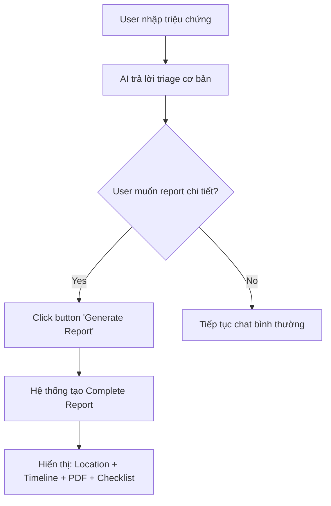

# Kế hoạch Implementation: Tăng cường Triage Report với AI Decision-Making

## Tổng quan

Dự án này nhằm phân tích lại chức năng triage report hiện tại và thêm khả năng cho AI tự quyết định khi nào nên tạo triage report chi tiết dựa trên ngữ cảnh và mức độ nghiêm trọng của tình huống.

## Phân tích Hệ thống Hiện tại

### 1. Kiến trúc Triage Hiện tại

Hệ thống Medagen hiện tại có **3 workflows chính**:

#### 1.1. Triage Workflow (Symptoms → Assessment)
- **Trigger**: User báo triệu chứng cụ thể
- **Input**: Text (+ optional image)
- **Process**:
  1. Intent classification
  2. CV analysis (nếu có ảnh)
  3. Triage Rules evaluation
  4. RAG guideline search
  5. LLM synthesis
- **Output**: `TriageResult` với cấu trúc chuẩn

#### 1.2. Disease Info Query (Educational)
- **Trigger**: User hỏi về bệnh cụ thể ("Bệnh X là gì?")
- **Input**: Text query
- **Process**:
  1. Knowledge base search (CSDL)
  2. RAG fallback
  3. Educational response synthesis
- **Output**: `TriageResult` với `triage_level: "routine"`

#### 1.3. General Health Query
- **Trigger**: Câu hỏi sức khỏe chung
- **Process**: RAG search + LLM synthesis
- **Output**: Educational response

### 2. Cấu trúc TriageResult Hiện tại

```typescript
interface TriageResult {
  triage_level: 'emergency' | 'urgent' | 'routine' | 'self_care';
  symptom_summary: string;
  red_flags: string[];
  suspected_conditions: Array<{
    name: string;
    source: 'cv_model' | 'guideline' | 'user_report' | 'reasoning';
    confidence: 'low' | 'medium' | 'high';
  }>;
  cv_findings: {
    model_used: 'derm_cv' | 'eye_cv' | 'wound_cv' | 'none';
    raw_output: any;
  };
  recommendation: {
    action: string;
    timeframe: string;
    home_care_advice: string;
    warning_signs: string;
  };
}
```

### 3. Vấn đề Hiện tại

> [!IMPORTANT]
> **Thiếu tính năng Triage Report chi tiết**
> 
> Hiện tại, hệ thống **LUÔN** trả về `TriageResult` cho mọi query, bất kể đó là:
> - Câu hỏi giáo dục đơn giản ("Mụn trứng cá là gì?")
> - Triệu chứng nghiêm trọng cần đánh giá kỹ
> - Tình huống cấp cứu
> 
> **AI không có khả năng quyết định** khi nào cần tạo **Triage Report chi tiết** với:
> - Phân tích sâu về triệu chứng
> - Đánh giá rủi ro đa chiều
> - Lộ trình hành động rõ ràng
> - Tracking timeline

---

## Đề xuất Giải pháp - USER-TRIGGERED APPROACH

### Ý tưởng Cốt lõi (Đơn giản & Rõ ràng)

> [!NOTE]
> **Nguyên tắc:**
> 
> User **chủ động click button** "Generate Triage Report" → Hệ thống tạo **Complete Triage Report**

**Tại sao dùng button thay vì AI auto-detect?**
- ✅ **Rõ ràng**: User biết chính xác khi nào có report
- ✅ **Kiểm soát**: User quyết định khi nào cần report chi tiết
- ✅ **Đơn giản**: Không cần logic phức tạp để đoán "đủ thông tin"
- ✅ **UX tốt**: Không có "surprise behavior" từ AI

### User Flow



### Triage Report Components

**Khi user click button, Report bao gồm:**

| Component | Mô tả | Trigger |
|-----------|-------|---------|
| **Symptom Analysis** | Phân tích triệu chứng chi tiết | Auto từ conversation |
| **Triage Level** | Emergency/Urgent/Routine/Self-care | Từ AI response |
| **Red Flags** | Các dấu hiệu cảnh báo | Từ AI response |
| **CV Findings** | Kết quả phân tích ảnh (nếu có) | Từ AI response |
| **Recommendations** | Hành động cụ thể + timeline | Enhanced từ AI |
| **📍 Location** | Danh sách cơ sở y tế gần nhất | **API call khi generate** |
| **📄 PDF Export** | Khả năng export report dạng PDF | **Generated on-demand** |
| **Follow-up** | Checklist theo dõi | **Generated on-demand** |

---

## Proposed Changes

### Component: Backend API

#### [NEW] `/api/triage/generate-report` endpoint

**Purpose**: API endpoint để generate complete triage report khi user click button

**Method**: `POST`

**Request Body:**
```typescript
{
  session_id: string;          // Để lấy conversation context
  message_id?: string;         // Message cụ thể để generate report
  user_location?: {            // Optional: User location để tìm cơ sở y tế gần
    lat: number;
    lng: number;
  }
}
```

**Response:**
```typescript
{
  report_id: string;
  report: CompleteTriageReport;  // Full report with all data
}
```

---

### Component: AI Agent Core

#### [MODIFY] [agent-executor.ts](file:///D:/Project/Medagen_master/Medagen/src/agent/agent-executor.ts)

**Changes:**
- Thêm method `generateCompleteTriageReport()` - Tạo report từ conversation context
- **Không cần** logic "hasEnoughInformation" nữa - user trigger rồi
- Method nhận `sessionId` và `messageId` để extract data

**Implementation Details:**
```typescript
async generateCompleteTriageReport(
  sessionId: string,
  messageId?: string,
  userLocation?: { lat: number; lng: number }
): Promise<CompleteTriageReport> {
  // 1. Get conversation context from session
  const conversation = await this.getConversation(sessionId);
  
  // 2. Extract triage data from last AI response
  const triageData = this.extractTriageData(conversation, messageId);
  
  // 3. Get nearby medical facilities
  const facilities = await this.locationService.findNearbyFacilities(
    userLocation,
    triageData.triage_level
  );
  
  // 4. Generate timeline & checklist
  const followUp = this.generateFollowUp(triageData);
  
  // 5. Prepare PDF export metadata
  const pdfExport = await this.pdfService.preparePDFExport(triageData);
  
  // 6. Combine all into complete report
  return {
    report_type: 'complete',
    ...triageData,
    nearby_facilities: facilities,
    pdf_export: pdfExport,
    follow_up: followUp,
    metadata: {
      generated_at: new Date().toISOString(),
      report_id: generateReportId(),
      session_id: sessionId
    }
  };
}
```

---

#### [NEW] [triage-report.service.ts](file:///D:/Project/Medagen_master/Medagen/src/services/triage-report.service.ts)

**Purpose**: Service để tạo complete triage report với tất cả features

**Responsibilities:**
- Format comprehensive triage report
- Integrate location data từ Maps
- Prepare data cho PDF export
- Generate timeline & follow-up checklist
- Calculate severity scores

---

#### [NEW] [pdf-export.service.ts](file:///D:/Project/Medagen_master/Medagen/src/services/pdf-export.service.ts)

**Purpose**: Service để export triage report sang PDF

**Tech Stack:** 
- `pdfkit` hoặc `puppeteer` cho PDF generation
- Custom template cho medical report format

**Features:**
- Professional medical report layout
- Include all triage data
- QR code for digital access
- Printable format

---

#### [MODIFY] [system-prompt.ts](file:///D:/Project/Medagen_master/Medagen/src/agent/system-prompt.ts)

**Changes:**
- Cập nhật hướng dẫn: Khi đủ info → tạo complete report
- Thêm format mẫu cho complete triage report
- Instructions về khi nào cần location data

---

### Component: Location Integration

#### [NEW] [location.service.ts](file:///D:/Project/Medagen_master/Medagen/src/services/location.service.ts)

**Purpose**: Service để tìm cơ sở y tế gần nhất

**Integration:**
- Sử dụng existing Maps tool/API
- Filter theo triage level (Emergency → Bệnh viện có cấp cứu)
- Return sorted by distance

**Data Structure:**
```typescript
interface MedicalFacility {
  name: string;
  address: string;
  distance_km: number;
  facility_type: 'emergency' | 'hospital' | 'clinic';
  phone: string;
  coordinates: { lat: number; lng: number };
  capabilities: string[]; // ["cấp cứu", "nội khoa", ...]
}
```

---

### Component: Type Definitions

#### [MODIFY] [types/index.ts](file:///D:/Project/Medagen_master/Medagen/src/types/index.ts)

**Changes:**
- Thêm `CompleteTriageReport` interface
- Thêm `MedicalFacility` interface
- Thêm `PDFExportMetadata` interface
- Extend `TriageResult` để support complete report

**New Types:**
```typescript
export interface CompleteTriageReport extends TriageResult {
  report_type: 'complete';
  
  // Core triage data (existing)
  triage_level: TriageLevel;
  symptom_summary: string;
  red_flags: string[];
  suspected_conditions: SuspectedCondition[];
  cv_findings: CVFindings;
  recommendation: Recommendation;
  
  // NEW: Location data
  nearby_facilities: MedicalFacility[];
  
  // NEW: PDF export metadata
  pdf_export: PDFExportMetadata;
  
  // NEW: Follow-up & tracking
  follow_up: {
    checklist: string[];
    timeline: ActionTimeline;
    warning_signs_monitor: string[];
  };
  
  // Metadata
  metadata: {
    generated_at: string;
    report_id: string;
    has_sufficient_info: boolean;
  };
}

export interface MedicalFacility {
  name: string;
  address: string;
  distance_km: number;
  facility_type: 'emergency' | 'hospital' | 'clinic' | 'specialist';
  phone?: string;
  coordinates: { lat: number; lng: number };
  capabilities: string[];
  working_hours?: string;
  accepts_emergency?: boolean;
}

export interface PDFExportMetadata {
  available: boolean;
  download_url?: string;
  qr_code?: string;
  expires_at?: string;
}

export interface ActionTimeline {
  immediate: string;      // Ngay lập tức
  within_hours: string;   // Trong vài giờ
  within_days: string;    // Trong vài ngày
  follow_up: string;      // Tái khám
}
```

---

### Component: Frontend Display

#### [NEW] [GenerateReportButton.tsx](file:///D:/Project/Medagen_master/Medagen/frontend/components/atoms/GenerateReportButton.tsx)

**Purpose**: Button để trigger triage report generation

**Placement**: Hiển thị sau mỗi AI response có triage_level

**Props:**
```typescript
interface GenerateReportButtonProps {
  sessionId: string;
  messageId: string;
  triageLevel: TriageLevel;
  onReportGenerated: (report: CompleteTriageReport) => void;
}
```

**Features:**
- Icon + text: "📋 Generate Full Report"
- Loading state khi đang generate
- Tooltip: "Get detailed report with nearby facilities and PDF export"
- Only show quando triage_level !== 'routine' (hoặc luôn show)
- Click → call API → show report modal

---

#### [NEW] [CompleteTriageReportCard.tsx](file:///D:/Project/Medagen_master/Medagen/frontend/components/organisms/CompleteTriageReportCard.tsx)

**Purpose**: Component hiển thị complete triage report với tất cả tính năng

**Display Mode**: Modal hoặc Full-page overlay

**Features:**
- **Header Section**: Report ID, timestamp, close button
- **Triage Summary Section**: Level badge, red flags, symptom summary
- **CV Findings Section**: Hiển thị kết quả phân tích ảnh với confidence
- **Recommendations Section**: Action items với timeline cards
- **📍 Location Map Section**: 
  - Interactive map với markers
  - List cơ sở y tế gần nhất (sortable by distance)
  - "Get Directions" button cho mỗi facility
  - Filter theo loại cơ sở (emergency/hospital/clinic)
- **📄 PDF Export Section**: 
  - "Download PDF" button
  - "Share via Email" option
  - QR code để share (collapsible)
- **Follow-up Checklist Section**: 
  - Interactive checkboxes
  - Save to local storage
  - "Add to Calendar" integration
- **Footer**: Print button, Share button
- **Responsive Design**: Mobile-friendly
- **Accessibility**: Keyboard navigation, screen reader support

---

#### [NEW] [LocationMap.tsx](file:///D:/Project/Medagen_master/Medagen/frontend/components/molecules/LocationMap.tsx)

**Purpose**: Component hiển thị bản đồ với các cơ sở y tế

**Tech Stack:**
- Google Maps React hoặc Leaflet
- Custom markers cho từng loại facility
- Click to get directions

---

#### [NEW] [PDFExportButton.tsx](file:///D:/Project/Medagen_master/Medagen/frontend/components/atoms/PDFExportButton.tsx)

**Purpose**: Button component để trigger PDF export

**Features:**
- Loading state khi generate
- Download progress
- Share options (email, print)
- QR code modal

---

## Verification Plan

### Automated Tests

#### Unit Tests
```bash
# Test decision logic
npm test src/agent/agent-executor.test.ts

# Test report generation
npm test src/services/detailed-triage-report.service.test.ts
```

#### Integration Tests
```bash
# Test end-to-end triage flow với different scenarios
npm test src/__tests__/integration/triage-report.test.ts
```

**Test Scenarios:**
1. **Simple Educational Query** → Should NOT trigger detailed report
2. **Emergency Symptoms** → Should trigger detailed report
3. **Image with High Confidence** → Should trigger detailed report
4. **Multiple Red Flags** → Should trigger detailed report
5. **Routine Check** → Should NOT trigger detailed report

### Manual Verification

#### Frontend Testing
1. Test với UI để xem detailed report display
2. Verify responsive design
3. Check print layout
4. Test accessibility

#### User Flow Testing
1. Submit query: "Đau ngực dữ dội, khó thở"
   - Expected: Detailed Triage Report generated
2. Submit query: "Mụn trứng cá là gì?"
   - Expected: Simple educational response
3. Submit image with clear pathology
   - Expected: Detailed Triage Report with CV analysis

---

## Implementation Timeline

| Phase | Tasks | Estimated Time |
|-------|-------|----------------|
| **Phase 1** | Backend logic (decision + generation) | 3-4 hours |
| **Phase 2** | Type definitions & interfaces | 1 hour |
| **Phase 3** | Frontend component | 2-3 hours |
| **Phase 4** | Testing & refinement | 2 hours |
| **Total** | | **8-10 hours** |

---

## Example Output

### Scenario: User có đủ thông tin

**Input:** "Đau ngực dữ dội, khó thở, mồ hôi lạnh từ 30 phút nay"

**Output - Complete Triage Report:**
```json
{
  "report_type": "complete",
  "triage_level": "emergency",
  "symptom_summary": "Đau ngực dữ dội kèm khó thở và mồ hôi lạnh, triệu chứng bắt đầu 30 phút trước",
  "red_flags": [
    "Đau ngực dữ dội",
    "Khó thở",
    "Mồ hôi lạnh",
    "Triệu chứng cấp tính < 1 giờ"
  ],
  "suspected_conditions": [
    {
      "name": "Nghi ngờ nhồi máu cơ tim cấp",
      "source": "reasoning",
      "confidence": "high"
    },
    {
      "name": "Suy tim cấp",
      "source": "reasoning",
      "confidence": "medium"
    }
  ],
  "cv_findings": {
    "model_used": "none",
    "raw_output": {}
  },
  "recommendation": {
    "action": "GỌI 115 NGAY - KHÔNG TỰ ĐI. Đây là tình huống cấp cứu y khoa.",
    "timeframe": "NGAY LẬP TỨC - mỗi phút đều quan trọng",
    "home_care_advice": "Nằm nghỉ, nới lỏng quần áo, không vận động. Chờ xe cấp cứu.",
    "warning_signs": "Đau ngực lan ra cánh tay trái, hàm, lưng. Mất ý thức. Ngừng thở."
  },
  
  // NEW: Location data
  "nearby_facilities": [
    {
      "name": "Bệnh viện Chợ Rẫy",
      "address": "201B Nguyễn Chí Thanh, Quận 5, TP.HCM",
      "distance_km": 2.3,
      "facility_type": "emergency",
      "phone": "028 3855 4137",
      "coordinates": { "lat": 10.7546, "lng": 106.6639 },
      "capabilities": ["Cấp cứu 24/7", "Khoa Tim mạch", "ICU", "Phẫu thuật tim"],
      "working_hours": "24/7",
      "accepts_emergency": true
    },
    {
      "name": "Bệnh viện Đại học Y Dược TP.HCM",
      "address": "215 Hồng Bàng, Quận 5, TP.HCM",
      "distance_km": 2.8,
      "facility_type": "emergency",
      "phone": "028 3855 2010",
      "coordinates": { "lat": 10.7584, "lng": 106.6571 },
      "capabilities": ["Cấp cứu 24/7", "Khoa Tim mạch", "ICU"],
      "working_hours": "24/7",
      "accepts_emergency": true
    }
  ],
  
  // NEW: PDF export
  "pdf_export": {
    "available": true,
    "download_url": "/api/reports/download/abc123.pdf",
    "qr_code": "data:image/png;base64,iVBORw0KG...",
    "expires_at": "2025-11-30T00:00:00Z"
  },
  
  // NEW: Follow-up
  "follow_up": {
    "checklist": [
      "☐ Đã gọi 115",
      "☐ Đã nằm nghỉ",
      "☐ Đã nới lỏng quần áo",
      "☐ Có người ở bên cạnh"
    ],
    "timeline": {
      "immediate": "Gọi 115 NGAY - Không tự đi",
      "within_hours": "ECG, xét nghiệm Troponin, đánh giá tim mạch",
      "within_days": "Theo dõi tại bệnh viện",
      "follow_up": "Tái khám tim mạch sau xuất viện"
    },
    "warning_signs_monitor": [
      "Đau ngực tăng hoặc không giảm",
      "Khó thở nặng hơn",
      "Mất ý thức",
      "Da xanh tím"
    ]
  },
  
  "metadata": {
    "generated_at": "2025-11-23T00:03:00+07:00",
    "report_id": "TR-20251123-ABC123",
    "has_sufficient_info": true
  }
}
```

### Scenario: Không đủ thông tin

**Input:** "Sức khỏe là gì?"

**Output - Simple Response (no complete report):**
```json
{
  "triage_level": "routine",
  "symptom_summary": "Câu hỏi giáo dục chung về sức khỏe",
  "red_flags": [],
  "suspected_conditions": [],
  "cv_findings": {
    "model_used": "none",
    "raw_output": {}
  },
  "recommendation": {
    "action": "Sức khỏe là trạng thái hoàn hảo về thể chất, tinh thần và xã hội...",
    "timeframe": "Không áp dụng",
    "home_care_advice": "Duy trì lối sống lành mạnh...",
    "warning_signs": "Thông tin chỉ mang tính tham khảo"
  }
  // NO location, NO PDF, NO complete report features
}
```

---

## User Review Required

> [!IMPORTANT]
> **New Features & Dependencies**
> 
> - **PDF Library**: Recommend `pdfkit` (server-side) hoặc `jsPDF` (client-side)?
> - **Maps Integration**: Cần confirm có Google Maps API key chưa?
> - **Location Data**: Dùng Google Places API hay cần database riêng cho cơ sở y tế VN?
> - **User Location**: Có request browser geolocation permission không?

> [!NOTE]
> **Benefits of Button Approach**
> 
> - ✅ **User Control**: User chủ động trigger, không bị surprise
> - ✅ **Clear UX**: Rõ ràng khi nào có report chi tiết
> - ✅ **Performance**: Chỉ generate khi cần, tiết kiệm API calls
> - ✅ **No AI Guessing**: Không cần logic phức tạp để đoán "đủ thông tin"
> - ✅ **Backward Compatible**: Chat flow hiện tại không thay đổi

---

## Summary

### Key Changes from Original Plan

| Aspect | Original (AI Auto-detect) | New (Button-triggered) |
|--------|---------------------------|------------------------|
| **Trigger** | AI tự quyết định | User click button |
| **Logic Complexity** | Cần detect "đủ thông tin" | Không cần detect |
| **UX** | Có thể confusing | Rõ ràng, predictable |
| **Implementation** | Phức tạp hơn | Đơn giản hơn |
| **User Control** | Thấp | Cao |

### Implementation Flow

```
1. User chat với AI về triệu chứng
   ↓
2. AI trả lời triage (emergency/urgent/routine/self-care)
   ↓
3. UI hiển thị button "📋 Generate Full Report"
   ↓
4. User click button (optional)
   ↓
5. Frontend call API POST /api/triage/generate-report
   ↓
6. Backend:
   - Extract triage data từ session
   - Get nearby facilities
   - Generate PDF export metadata
   - Create follow-up checklist
   ↓
7. Return CompleteTriageReport
   ↓
8. Frontend hiển thị report modal với:
   - Location map
   - PDF download
   - Follow-up checklist
   - Timeline
```
